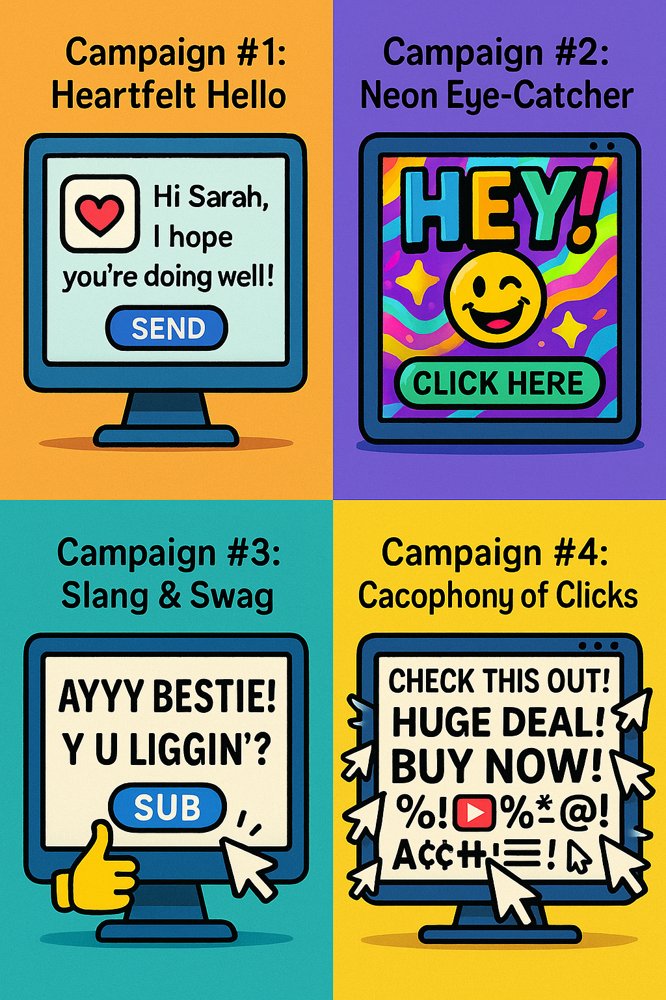

# 🚀 Quickstart
clone the repository and run the following command in the root directory of the project:

```bash
uv sync
```

Activate your `.venv` (see [codestyle](https://github.com/raoulg/codestyle/blob/main/docs/dependencies_management.md) if you dont know how to do that)

# 1. 🏗️ Modelling
## 🦠 Covid demo
Have a look at the [demo](demo/linear.py) to see how to use the `goad-toolkit` library.

Have a look at the github repository of GOAD🐐[here](https://github.com/raoulg/goad_toolkit)

You can run the demo by 1) activating your virtual environment 2) running the following command in the root directory of the project:

```bash
python demo/linear.py
```

## 🛠️ Create your own covid model
The notebook should help you with creating your own improved model.
After you have tested your model, create a `main.py` script that follows the same structure as the `linear.py` script in the demo folder.
You should be able to run the `main.py` script, and it should run your whole pipeline from data loading and preprocessing to model evaluation.

# 2. 🎯 A/B Testing Challenge: Optimizing an Email Campaign
Your mission, should you choose to accept it, involves optimizing a new email marketing campaign.

## 🎧 Audio material

I created a podcast from the notebooks 02-05. You can listen to it [here](https://notebooklm.google.com/notebook/709ab996-7bc9-4968-b96e-300bf3454d2e/audio)

It will help you understand the notebooks, so its a good idea to listen to it before starting the challenge.

## 📖 The Storyline
<div align="center">
  
</div>


Our creative team has developed four distinct email strategies (let's call them Strategy 0, 1, 2, and 3) to promote a new product. We know *some* strategies will perform better than others (i.e., lead to more email opens), but we don't know which ones or by how much.

Your task is twofold:

1.  **Test:** Determine the effectiveness (open rate) of each of the four strategies.
2.  **Optimize:** Use your findings to run the *best* campaign possible, maximizing email opens while minimizing the number of emails sent using less effective strategies. You need to balance *exploring* the different strategies to learn about them and *exploiting* the strategy that seems to be winning.

To do this, you'll interact with a simulation server that mimics sending out emails based on the strategy you choose and reports back whether the email was opened. However, like in the real world, you have constraints!

Instead of just testing each strategy an equal number of times (uniform sampling, which is statistically solid but you will waste resources by sending ineffective emails), you will implement **Thompson Sampling** (as detailed in the `05_abtesting.ipynb` notebook) to intelligently explore and exploit the different strategies.

## 🐍 Understanding the Demo Script
The provided Python script (`demo/abtesting.py`) gives you the tools to interact with the campaign server. You can run it with:

```bash
python demo/abtesting.py
```

Let's break down the key components:

1.  **`QueryAPI` Class:**
    * **Purpose:** This class handles all communication with the email campaign server. It sends requests to test a specific strategy and retrieves the results.
    * **Email Prompt:** The *first time* you run the script, it will ask for your email address (`Please enter your email address:`). This email is crucial! It's used to:
        * Identify you on the **leaderboard**.
        * Track your usage against the **API rate limits**.
    * **Caching:** After you enter your email once, the script saves it in a `.cache/email.json` file so you don't have to type it in every time.
    * **Methods:**
        * `get_campaign(strategy)`: Sends a request to test a specific `strategy` (0-3) and returns whether the email was opened (1) or not (0). It also handles rate limit errors gracefully.
        * `get_remaining()`: Checks how many API calls you have left within the limits.
        * `get_leaderboard()`: Fetches the current leaderboard data.
        * `formatted_leaderboard()`: Gets the leaderboard data and formats it nicely for printing.

2.  **`FileHandler` Class:**
    * **Purpose:** This class manages saving your results locally.
    * **Saving Results:** Every time you successfully test a strategy using `evaluate_strategy`, the result (strategy number, opened status, timestamp, timezone) is appended to a CSV file: `data/result/campaign_results.csv`. This creates a record of your experiments.
    * **Loading Results:** The `load_results()` method can be used to load all your past results into a pandas DataFrame for analysis.

3.  **`CampaignManager` Class:**
    * **Purpose:** This acts as a wrapper, simplifying the process of running a test.
    * **`evaluate_strategy(strategy)`**: This is the main method you'll likely use in your own code. It takes a `strategy` number:
        * Calls `query_api.get_campaign()` to interact with the server.
        * If successful, it calls `file_handler.store_result()` to save the outcome.
        * It returns `1` if the email was opened, `0` if not, or `None` if there was an error (like hitting a rate limit).

## 📈 Understanding the Demo Output

When you run `python demo/abtesting.py`, you'll see output similar to this:

```bash
❯ python demo/abtesting.py
Test 0 - randomly picked strategy 3
result: Email was Not Opened
Test 1 - randomly picked strategy 0
result: Email was Not Opened
Test 2 - randomly picked strategy 2
result: Email was Not Opened
Test 3 - randomly picked strategy 1
result: Email was Opened
Test 4 - randomly picked strategy 1
result: Email was Not Opened
2025-04-13 15:36:17.073 | INFO     | main:<module>:278 - results are stored in data/result/campaign_results.csv
Remaining attempts: {
'email': '[email address removed]',
'hourly': {
'remaining_requests': 20,
'limit': 30,
'reset_at': '2025-04-13T15:51:08.377273+02:00'
},
'general': {
'remaining_requests': 975,
'limit': 1000,
'reset_at': '2025-04-27T15:10:43.566269+02:00'
},
'timezone': 'Europe/Amsterdam'
}

Leaderboard:
Top Users by Success Ratio:
+--------+---------------------+----------------+--------------+------------------+
|   Rank | Email               | Success Rate   |   Successful |   Total Requests |
+========+=====================+================+==============+==================+
|      1 | [email address removed] | 8.00%          |            2 |               25 |
+--------+---------------------+----------------+--------------+------------------+

Top Users by Total Requests:
+--------+---------------------+------------------+--------------+----------------+
|   Rank | Email               |   Total Requests |   Successful | Success Rate   |
+========+=====================+==================+==============+================+
|      1 | [email address removed] |               25 |            2 | 8.00%          |
+--------+---------------------+------------------+--------------+----------------+
```

**Breakdown:**

1.  **Test Results:**
    * `Test X - randomly picked strategy Y`: Shows which test run (0-4 in this case) and which strategy was *randomly* chosen by the demo script.
    * `result: Email was Opened/Not Opened`: Tells you the outcome of that specific test.

2.  **Log Message:**
    * `INFO | __main__:<module>:278 - results are stored in data/result/campaign_results.csv`: Confirms that the results are being saved to your local CSV file.

3.  **Remaining Attempts (Rate Limits):**
    * This JSON blob shows your current API usage status.
    * `'hourly'`:
        * `'limit': 30`: You can make a maximum of **30 API calls per 15 minutes**.
        * `'remaining_requests': 20`: In this example, 20 calls are left in the current 15-minute window.
        * `'reset_at'`: Shows when the 15-minute window resets, and your count goes back to 30.
    * `'general'`:
        * `'limit': 1000`: You have a total limit of **1000 API calls per 14 days**.
        * `'remaining_requests': 975`: In this example, 975 calls are left in the current 14-day period.
        * `'reset_at'`: Shows when the 14-day limit resets.
    * **Important:** Having limits is realistic! Real-world scenarios often have all sorts of limits: api-limits, time-limits, budget-limits, customer-limits, etc. Therefore: **Plan your experiments carefully!** You can't just run thousands of tests in a few minutes and bruteforce your way through this. Starting early gives you more time windows and therefore more total potential calls. If you hit the limit, you'll have to wait. Of course, you are allowed to write a script to automate this, but keep the objectives in mind when you do this!

4.  **Leaderboard:**
    * Shows the top 5 performers (only 1 in this example) based on their results so far.
    * `Top Users by Success Ratio`: Ranks users based on the percentage of their API calls that resulted in an "Opened" email (`Successful / Total Requests`). Highlighting efficiency.
    * `Top Users by Total Requests`: Ranks users based on how many API calls they've made. This shows who has experimented the most.
    * **Your Goal:** While appearing on the leaderboard is nice, the *real* goal is to use the Thompson Sampling algorithm effectively. This means:
        * Quickly identifying the likely best-performing strategy.
        * Gathering enough data to have reasonable estimates of the open rates for *all* strategies.
        * Minimizing "regret" - that is, minimizing the number of times you test strategies that turn out to be suboptimal.

## 🎬 Action
Now, adapt the demo script and the Thompson Sampling logic from the notebook to tackle this challenge! Good luck!
